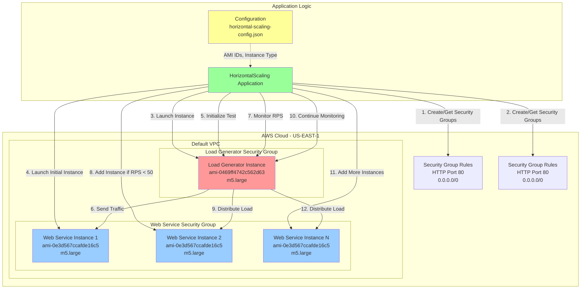

# AWS Horizontal Scaling Solution

A Java-based implementation for automatic horizontal scaling of web services on Amazon Web Services (AWS) EC2. This project demonstrates dynamic infrastructure provisioning based on real-time performance metrics.

## Overview

This application implements an automated horizontal scaling solution that:
- Provisions and manages AWS EC2 instances dynamically
- Monitors web service performance in real-time
- Automatically scales resources based on Requests Per Second (RPS) metrics
- Uses a Load Generator to simulate traffic and validate scaling behavior

## Architecture



## Workflow

### 1. **Initialization Phase**
   - Application reads configuration from `horizontal-scaling-config.json`
   - Establishes AWS EC2 client connection with credentials
   - Retrieves the default VPC in US-EAST-1 region

### 2. **Security Group Setup**
   - Creates or retrieves security groups for Load Generator and Web Services
   - Configures inbound HTTP traffic on port 80
   - Tags all resources with `project: vm-scaling`

### 3. **Instance Provisioning**
   - Launches Load Generator instance
   - Launches initial Web Service instance
   - Waits for instances to reach running state
   - Tags network interfaces for tracking

### 4. **Test Initialization**
   - Registers Web Service DNS with Load Generator
   - Initiates horizontal scaling test
   - Obtains unique test ID for monitoring

### 5. **Dynamic Scaling Loop**
   ```
   WHILE test is not finished:
       - Monitor RPS from Load Generator logs
       - Check if 100+ seconds have passed since last launch
       - IF RPS < 50 AND time_elapsed > 100 seconds:
           * Provision new Web Service instance
           * Register with Load Generator
           * Update last launch time
       - Sleep and repeat
   ```

### 6. **Performance Monitoring**
   - Continuously polls Load Generator for test logs
   - Parses RPS metrics from INI-formatted log files
   - Tracks test completion status

## Project Structure

```
aws-horizontal-scaling/
├── src/
│   └── main/
│       ├── java/
│       │   ├── horizontal/
│       │   │   └── HorizontalScaling.java    # Main application logic
│       │   └── utilities/
│       │       ├── Configuration.java         # JSON configuration parser
│       │       └── HttpRequest.java           # HTTP utility for LG communication
│       └── resources/
│           └── horizontal-scaling-config.json # AWS resource configuration
├── pom.xml                                    # Maven dependencies
├── references                                 # API reference documentation
└── README.md                                  # This file
```

## Prerequisites

- **Java Development Kit (JDK)**: Version 1.8 or higher
- **Apache Maven**: For dependency management and building
- **AWS Account**: With appropriate permissions
- **AWS Credentials**: Configured for programmatic access
  - Access Key ID
  - Secret Access Key
  - Credentials should be available via AWS Default Credentials Provider

## AWS Permissions Required

The application requires the following AWS IAM permissions:
- `ec2:DescribeVpcs`
- `ec2:DescribeSecurityGroups`
- `ec2:CreateSecurityGroup`
- `ec2:AuthorizeSecurityGroupIngress`
- `ec2:RunInstances`
- `ec2:DescribeInstances`
- `ec2:CreateTags`
- `ec2:DescribeInstanceStatus`

## Dependencies

The project uses the following key dependencies:

- **AWS SDK for Java v2** (2.17.229)
  - `software.amazon.awssdk:ec2` - EC2 service operations
  - `software.amazon.awssdk:core` - Core SDK functionality

- **Utilities**
  - `ini4j` (0.5.4) - INI file parsing for log analysis
  - `commons-io` (2.6) - File operations
  - `org.json` (20180813) - JSON parsing
  - `slf4j-simple` (1.7.36) - Logging framework
  - `guice` (4.2.2) - Dependency injection

## Configuration

Edit `src/main/resources/horizontal-scaling-config.json` to customize:

```json
{
  "load_generator_ami": "ami-0469ff4742c562d63",
  "web_service_ami": "ami-0e3d567ccafde16c5",
  "instance_type": "m5.large"
}
```

### Configuration Parameters

| Parameter | Description | Default Value |
|-----------|-------------|---------------|
| `load_generator_ami` | AMI ID for Load Generator instance | ami-0469ff4742c562d63 |
| `web_service_ami` | AMI ID for Web Service instances | ami-0e3d567ccafde16c5 |
| `instance_type` | EC2 instance type for all instances | m5.large |

### Application Constants

Key constants in `HorizontalScaling.java`:

| Constant | Value | Description |
|----------|-------|-------------|
| `RPS_TARGET` | 50 | Target RPS threshold for scaling |
| `LAUNCH_DELAY` | 100000 ms | Minimum time between instance launches |
| `HTTP_PORT` | 80 | HTTP port for security group rules |
| `TAG_KEY` / `TAG_VALUE` | project / vm-scaling | Resource tagging |

## Setup and Installation

### 1. Clone the Repository

```bash
git clone https://github.com/vismithaN/aws-horizontal-scaling.git
cd aws-horizontal-scaling
```

### 2. Configure AWS Credentials

Set up AWS credentials using one of these methods:

**Option A: AWS Credentials File** (`~/.aws/credentials`)
```ini
[default]
aws_access_key_id = YOUR_ACCESS_KEY_ID
aws_secret_access_key = YOUR_SECRET_ACCESS_KEY
```

**Option B: Environment Variables**
```bash
export AWS_ACCESS_KEY_ID=YOUR_ACCESS_KEY_ID
export AWS_SECRET_ACCESS_KEY=YOUR_SECRET_ACCESS_KEY
export AWS_DEFAULT_REGION=us-east-1
```

### 3. Build the Project

```bash
mvn clean install
```

### 4. Run the Application

```bash
mvn exec:java -Dexec.mainClass="horizontal.HorizontalScaling"
```

Or run the compiled JAR:

```bash
java -cp target/CC_Project-vm-scaling-task1-0.0.1-SNAPSHOT.jar horizontal.HorizontalScaling
```

## Usage

Once the application starts, it will:

1. **Automatically provision infrastructure** - Creates security groups and instances
2. **Initialize the test** - Starts the Load Generator test
3. **Monitor and scale** - Continuously monitors RPS and adds instances as needed
4. **Output progress** - Logs all actions to console

### Sample Output

```
Default VPC returned : vpc-xxxxxxxxx
GroupIDs obtained from both sg-xxxxxxxxx and sg-yyyyyyyyy
Created Instance with ID: i-xxxxxxxxx
Instance i-xxxxxxxxx is now running.
DNS name of both instances lb-xxxx.us-east-1.compute.amazonaws.com and ws-xxxx.us-east-1.compute.amazonaws.com
Get test ID 1234567890
Current Launch time 2024-01-10T12:00:00Z
Inside monitor log file. Current RPS 25.5
Starting new launcher
Launching new instance ws-yyyy.us-east-1.compute.amazonaws.com
```

## Key Features

### 1. **Intelligent Scaling Logic**
   - Monitors real-time RPS metrics
   - Implements cooldown period (100 seconds) between launches
   - Prevents over-provisioning while maintaining performance

### 2. **Resource Tagging**
   - All resources tagged with `project: vm-scaling`
   - Includes EC2 instances, security groups, and network interfaces
   - Enables easy resource tracking and cost allocation

### 3. **Robust Error Handling**
   - Retry logic for API calls
   - Wait conditions for instance state transitions
   - Graceful handling of network failures

### 4. **Security Group Management**
   - Checks for existing security groups before creating new ones
   - Reuses existing resources when possible
   - Configures minimal required permissions (HTTP only)

## API Endpoints (Load Generator)

The Load Generator exposes the following HTTP endpoints:

| Endpoint | Method | Description |
|----------|--------|-------------|
| `/test/horizontal?dns={dns}` | GET | Initialize horizontal scaling test |
| `/test/horizontal/add?dns={dns}` | GET | Add a new web service instance |
| `/log?name=test.{testId}.log` | GET | Retrieve test log file |

## Scaling Algorithm

```java
if (timeSinceLastLaunch > 100 seconds && currentRPS < 50) {
    provisionNewInstance();
    registerWithLoadGenerator();
    updateLastLaunchTime();
}
```

**Rationale:**
- **Time check**: Ensures instances have time to boot and warm up
- **RPS threshold**: Triggers scaling when performance degrades below target
- **Sequential provisioning**: Prevents resource waste from over-provisioning

## Troubleshooting

### Common Issues

1. **AWS Credentials Not Found**
   ```
   Error: Unable to load credentials from any provider
   Solution: Configure AWS credentials as described in Setup section
   ```

2. **Security Group Already Exists**
   ```
   The application automatically detects and reuses existing security groups
   No action needed - this is expected behavior
   ```

3. **Instance Launch Failures**
   ```
   Check AWS service limits for EC2 instances in us-east-1
   Verify AMI IDs are valid and accessible in your region
   ```

4. **Connection Timeout to Load Generator**
   ```
   Wait for instance to fully boot (may take 2-3 minutes)
   Application will retry automatically
   ```

## Cost Considerations

Running this application will incur AWS charges:
- **EC2 Instances**: m5.large on-demand pricing (~$0.096/hour per instance)
- **Data Transfer**: Minimal costs for HTTP traffic
- **Elastic IPs**: Free when associated with running instances

**Recommendation**: Terminate all resources after testing to avoid unnecessary charges.

## Limitations

- Fixed region: US-EAST-1 only
- Single VPC: Uses default VPC only
- No auto-termination: Resources persist after test completion
- Manual cleanup: User must terminate instances manually

## Future Enhancements

- [ ] Implement auto-scaling down when RPS exceeds target
- [ ] Add support for multiple AWS regions
- [ ] Integrate with AWS Auto Scaling Groups
- [ ] Add CloudWatch metrics integration
- [ ] Implement cost optimization strategies
- [ ] Add automated resource cleanup
- [ ] Support for custom VPC configuration
- [ ] Add health checks for web service instances

## References

### AWS SDK Documentation
- [AWS SDK for Java v2](https://docs.aws.amazon.com/sdk-for-java/latest/developer-guide/home.html)
- [EC2 Client Documentation](https://sdk.amazonaws.com/java/api/latest/software/amazon/awssdk/services/ec2/Ec2Client.html)
- [DescribeVpcsRequest](https://sdk.amazonaws.com/java/api/2.1.3/software/amazon/awssdk/services/ec2/model/DescribeVpcsRequest.html)
- [DescribeSecurityGroupsRequest](https://sdk.amazonaws.com/java/api/latest/software/amazon/awssdk/services/ec2/model/DescribeSecurityGroupsRequest.html)

### AWS Services
- [Amazon EC2 Documentation](https://docs.aws.amazon.com/ec2/)
- [EC2 Auto Scaling](https://docs.aws.amazon.com/autoscaling/ec2/userguide/what-is-amazon-ec2-auto-scaling.html)
- [VPC Documentation](https://docs.aws.amazon.com/vpc/)

## Contributing

Contributions are welcome! Please follow these guidelines:
1. Fork the repository
2. Create a feature branch
3. Commit your changes
4. Push to the branch
5. Create a Pull Request

## License

This project is provided for educational purposes.

## Author

Created as part of a cloud computing project demonstrating horizontal scaling concepts on AWS.

## Acknowledgments

- AWS SDK for Java team for comprehensive API support
- Apache Commons and other open-source library maintainers
